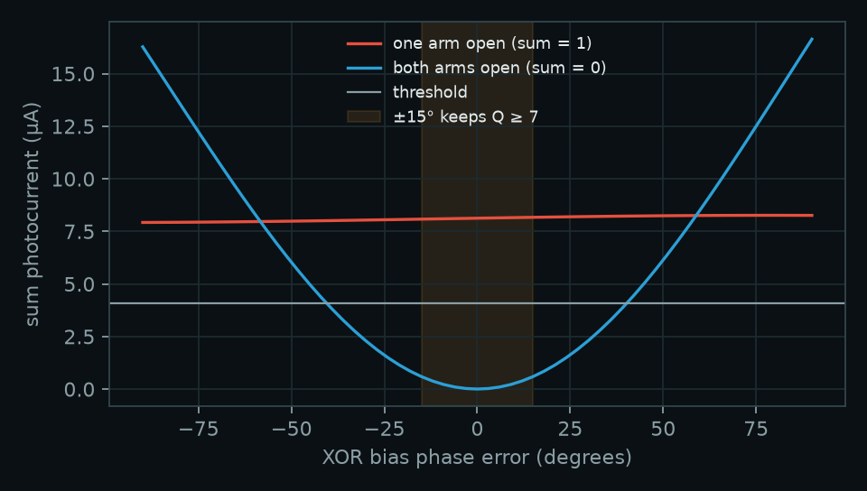
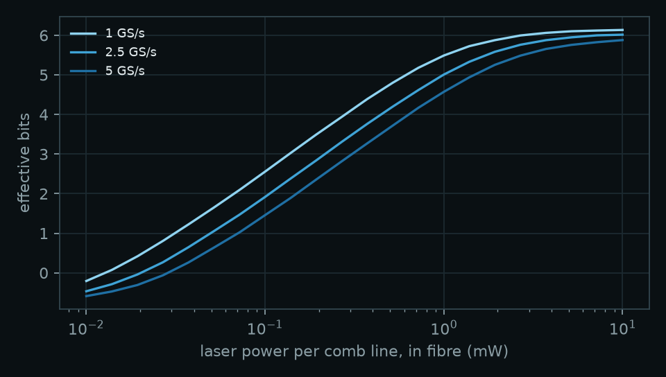
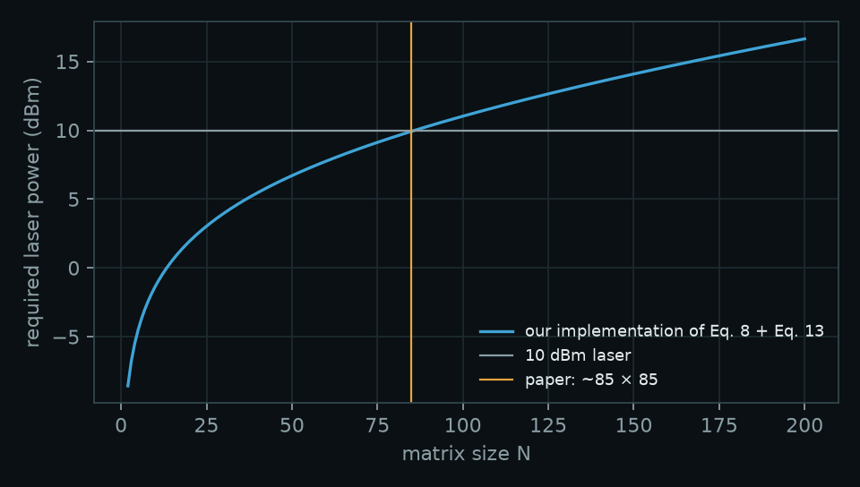

# Bench to Pixel

An interactive Three.js page that starts on the optical half adder from our paper and zooms out, step by step, until the same circuit is part of a GPU drawing a frame on a monitor.

Open `index.html` in a browser. Scroll to zoom out; drag to look around.

## What the page shows

1. **The bench.** The half adder from *Using Polarisation and Interference for Optical Computing* (Figure 14, section 4.1): a linearly polarised laser, beamsplitters S1 (5), S2 (6) and S3 (7), polarisers (3, 4) for intensity marking, mirrors (1, 2) converging both beams on the carry photoresistor, and a Michelson interferometer with mirrors (9, 10), two lenses (8) and a screen (11) with a hole on a dark fringe. Inputs A and B can be toggled.
2. **The silicon cell.** The same layout as a silicon photonic circuit: a fibre and grating coupler, Y-branches and a directional coupler, micro-ring modulators as inputs, Mach–Zehnder attenuators as weights, Sagnac loop mirrors, germanium photodiodes and a TIA + comparator.
3. **Optical tiles.** The carry gate read as a dot product, widened to 4×4 matrix–vector tiles.
4. **Shader cluster and die.** An ATTILA-style unified-shader GPU with the tile blocks inside its shader clusters.
5. **Card and desk.** A 2008-era graphics card with a laser module and fibre, on a test bench, driving a 22-inch monitor over DVI. The teapot scene on the monitor is rendered live, with the right half lit through the simulated optical tile; sliders set laser power, ADC bits and ring temperature error.
6. **Validation.** The simulation's ring and receiver models checked against two published papers.

## Simulation

`sim/pdk_sim.py` simulates the on-chip half of the page (not the optical breadboard) from published models:

| Part | Model | Source |
|---|---|---|
| Grating coupler, Y-branch, broadband directional coupler, half-ring coupler, strip waveguide | SiEPIC EBeam PDK compact models, via simphony 0.7.3 | [SiEPIC EBeam PDK](https://github.com/SiEPIC/SiEPIC_EBeam_PDK), [simphony](https://github.com/BYUCamachoLab/simphony) |
| Depletion ring modulators (rings B, C, D) | Decay times, doping and slopes from the paper; depletion width + Soref–Bennett free-carrier dispersion | Karimelahi et al., *Optics Express* 25(17), 20202 (2017) |
| Germanium photodiode | 0.82 A/W at −1 V, 5 mA/cm² dark current on 4 × 8 µm | Li et al., *Chinese Physics Letters* 37(3), 038503 (2020) |
| Receiver noise | Shot, 50 Ω thermal and −140 dB/Hz RIN noise, bandwidth DR/√2 (Eq. 8) | Al-Qadasi et al., *APL Photonics* 7, 020902 (2022) |
| Waveguide crossings | 0.16 dB per crossing | Bogaerts et al., *Optics Letters* 32(19), 2801 (2007) |

The half-adder cell is one [SAX](https://github.com/flaport/sax) netlist of PDK S-matrices, solved as a scattering network so every back-reflection is included. The ring modulators enter it as two-port elements. The heaters (two Mach–Zehnder attenuators and the Michelson bias) are calibrated per chip. The 4×4 tile uses single-pass transfer matrices of the same PDK parts and a Monte Carlo over random inputs and weights. Run it with:

```
pip install -r sim/requirements.txt
python3 sim/pdk_sim.py      # about a minute; writes sim/results.json and sim/figures/
```

**Half-adder cell** (1 mW of laser light in the fibre, inputs at 1 Gb/s, Ring D driven 0 / 4 V):

| A B | Carry (µA) | Sum (µA) |
|---|---|---|
| 0 0 | 1.1 | 0.00 |
| 0 1 | 59.5 | 8.43 |
| 1 0 | 39.2 | 8.13 |
| 1 1 | 95.8 | 0.00 |

- Carry decision Q ≈ 33 and sum decision Q ≈ 8.4; Q = 7 is one error in 10¹². The XOR needs at least 0.84 mW in the fibre.
- The XOR's dark output holds within ±15° of bias, which a 2.0 K temperature difference between the arms uses up.
- At the PDK's nine thickness (210/220/230 nm) and width (480/500/520 nm) corners, with heaters re-trimmed, every corner keeps Q ≥ 7.2 at 1 mW and needs at most 0.97 mW. With the nominal heater settings, 7 of 9 corners get the XOR wrong.
- Grating teeth 20 nm off nominal move the coupler's peak by about 50 nm and cost 7–16 dB at 1550 nm.
- A single-pass composition of the same cell under-predicts the XOR's one-arm output by 10–11%, mostly from light circulating in the Sagnac loop mirrors.



**4×4 tile** (four comb lines 200 GHz apart, add-drop ring demultiplexer from the PDK half-ring, Ring C inputs on 6-bit DACs, Mach–Zehnder weights on 8-bit heaters, 8-bit ADC): 5.3 effective bits at 2 mW per comb line in the fibre and 5 GS/s, noise-limited (5.5 bits with noise alone). It saturates near 6 bits, set by weight calibration and the input DACs. A single pole at the ring's 8.2 GHz electro-optic bandwidth leaves 3 × 10⁻⁵ of the previous symbol at 5 GS/s, so inter-symbol interference is ignored.



**Lighting on the monitor.** The page lights the right half of the monitor through a per-pixel model of the tile (input DAC, ring drift, weight error, noise, ADC) fitted to `lighting_circuit()`. At 2 mW per comb line the circuit gives an N·L error of 0.072 RMS and the page's model 0.068; at 0.5 mW, 0.252 and 0.249; at 2 mW with 0.05 K of ring drift, 0.330 and 0.332.

## Validation

Two checks run the same code against published results (`validate_rings()`, `validate_alqadasi()`).

**Ring modulators vs Karimelahi et al. 2017.** Inputs are each ring's field-amplitude decay times at −1 V (their Table 1) and one overlap factor calibrated to their index change per volt, which they give for the doped 75% of the ring. Everything else is predicted:

| Ring | Q model / paper | ERmax at 6 V (dB) | IL at 6 V (dB) | Min IL for 4 dB ER at 4 V (dB) | d(1/τ_l)/dV (10⁸ s⁻¹V⁻¹) |
|---|---|---|---|---|---|
| B | 4,880 / 4,971 | 7.3 / 8.8 | 13.3 / 12.4 | 10.8 / 9.4 | −2.4 / −4.4 |
| C | 19,623 / 20,068 | 17.0 / 17.8 | 4.6 / 3.8 | 2.7 / 2.5 | −2.5 / −2.4 |
| D | 33,914 / 34,627 | 20.7 / 20.0 | 1.5 / 1.4 | 1.1 / 1.0 | −3.0 / −2.6 |

Rings C and D, the two the cell and tile use, agree within 0.8 dB and 16%. Ring B has its heavily doped contacts closest to the waveguide (350 nm), and the model has no term for them. Q follows from the decay times, so it checks bookkeeping, not physics.

**Receiver and laser budget vs Al-Qadasi et al. 2022.** Our implementation of their Eq. 8 and Eq. 13 with their Table 3 losses and 1.2 A/W puts the largest binary micro-ring network a 10 dBm laser can drive at 85 × 85, the size they report.



**PDK data.** The SiEPIC half-ring S-matrix is slightly non-passive (largest singular value 1.004 at 1550 nm), which a resonator turns into gain. The demultiplexer rings therefore use only its coupling strength (|κ|² = 0.030) in a lossless coupler with the PDK waveguide's round trip. The Y-branch, directional coupler and grating coupler are passive (largest singular values 0.99, 0.99 and 0.78) and are used as given.

**Assumptions** (not from a PDK or a paper): 3 dB/cm strip waveguide loss, thermo-optic coefficient 1.86 × 10⁻⁴ /K, 0.3% RMS weight-calibration residual, 6-bit input and 8-bit heater DACs, and the ADC sampling at the end of each symbol. There is no full-wave electromagnetic simulation beyond what the PDK models contain, and no ring self-heating.

The first, analytic version of the simulation (assumed foundry-typical values) is kept in `sim/legacy/`.

## What is real

- **Built (2024):** optical AND, OR and XOR gates, a half adder that was correct for every input, and a full adder limited by photoresistor sensitivity, misalignment and bulk.
- **Standard parts:** grating couplers, Y-branches, directional couplers, ring modulators, thermo-optic Mach–Zehnders, loop mirrors and germanium photodiodes are in foundry design kits.
- **Simulated:** the half-adder cell and a 4×4 tile at circuit level, as above.
- **Proposed:** the tile's place inside the GPU. Nothing has been fabricated.

Bench distances, the carry meter values and the breadboard size are approximations; the paper does not give them.

## Credits

- Paper: *Using Polarisation and Interference for Optical Computing*, Atharv Dubey, Sanya Davalbhakta and Proteep Mallik, Student Research Journal 2024, Azim Premji University.
- GPU model: ATTILA by V. Moya, C. González, J. Roca, A. Fernández and R. Espasa, Universitat Politècnica de Catalunya ([paper, ISPASS 2006](https://hgpu.org/?p=2152), [source mirror](https://github.com/cooperyuan/attila)).
- Built with [three.js](https://threejs.org) r128, loaded from cdnjs and jsDelivr.

[F²R · Fiction to Reality](https://f2r.site)
